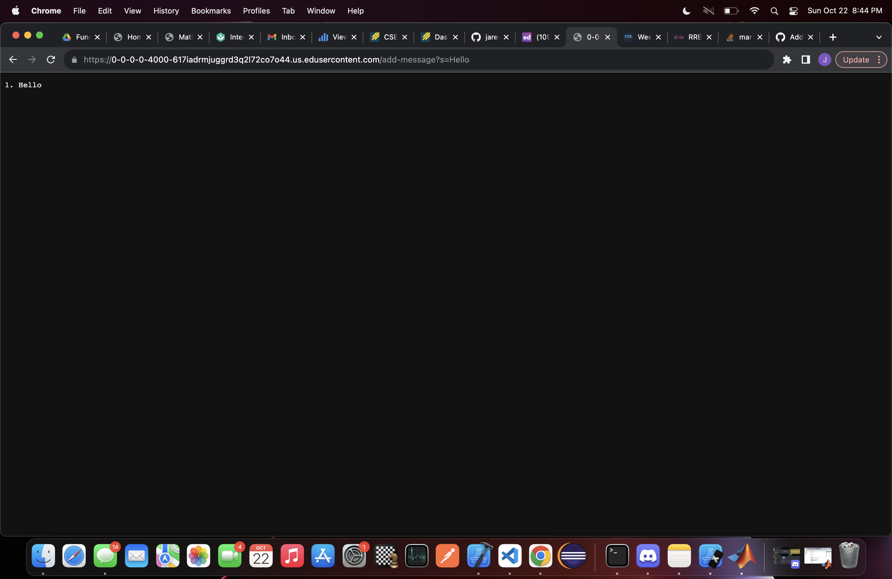
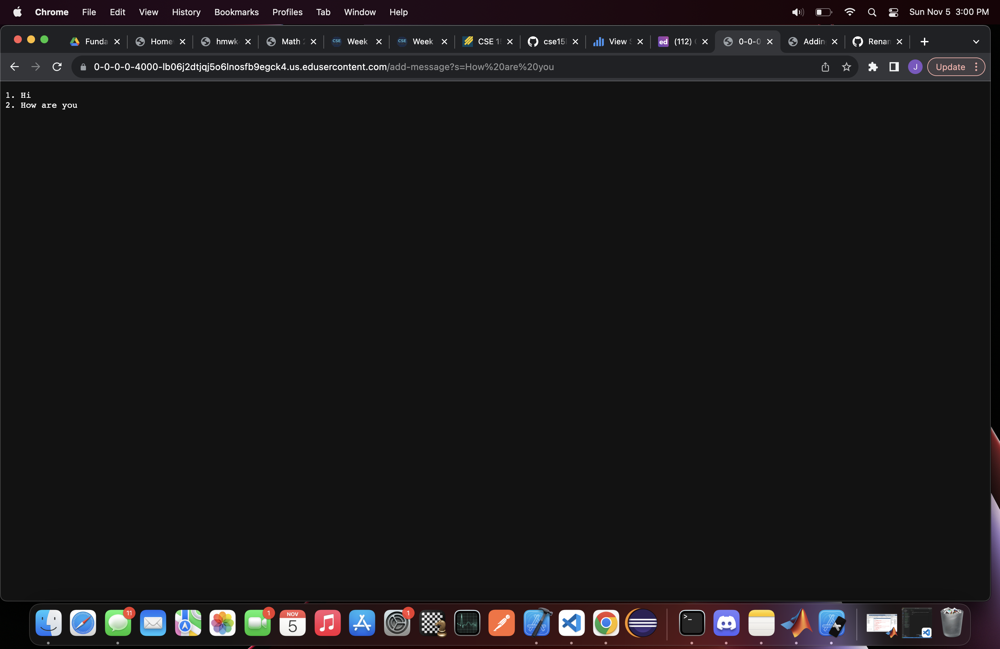

# Lab Report 2

# Part 1

1) The public string method, `handleRequest`
2) `handleRequest` is called with an URI as its arguement, and it looks at the string input after the "=" in the uri path. In this case, the string "Hi" is concatenated with the Handler class's string field called `emptyString`. Handler also uses an int field called `counter` that keeps track of the amount URI requests. Prior to the uri request, the default value of the `emptyString` field is an empty string ("") and the default value of the `counter` field is 1. 
3) The value of field `emptyString` is changed by first concatenating the value of `counter` with ") ", the string after "add-message?s=" within the uri path, and a line break " \n". Since 'counter' keeps track of the amount of requests made starting at 1, we have to add 1 every time there is a request in the uri path. In the moment, our fields look like:
    `emptyString = "1) Hi
                   `
    `counter = 2`

The emptyString field concatenates the string following "add-message?s=", and the counter field is a of type integer that keeps track of the amount of times the server loads a new URI request starting at count 1.  along with an integer field called counter, is mutable every time the server loads a new uri path with a string following "add-message?s=".

1) replace(), getPath(), getQuery(), split(), equals(), String.valueOf()
2) Replace allows us to replace the "+" added to queries with spaces, getPath() allows us to access the url, getQuery looks at the query paramter, equals makes a comparison between the first user input in the url, String.valueOf allows to typecast int to String to number list of words.

# Part 2)
1) /Users/papaj/.ssh/id_rsa.pub
2) /Users/papaj/.ssh/id_rsa.pub

# Part 3) 
I learned how to make directory with the mkdir command. I learned how to remove the need to enter passphrase when accessing remote computer using ssh-keygen and authorizing keys.  

# Code

import java.io.IOException;
import java.net.URI;
import java.util.*;

class Handler implements URLHandler {
    String emptyString = "";
    int count = 1 ;

    public String handleRequest(URI url) {
        if (url.getPath().equals("/")) {
            return "Nothing";
        } 
        
        else if (url.getPath().contains("/add-message")) {
            String[] addedWords = url.getQuery().split("=");
            if (addedWords[0].equals("s")) {
                emptyString += String.valueOf(count) + ". " + addedWords[1] + "\n";
                emptyString = emptyString.replace("+", " ");
                count += 1;
                return emptyString;
            }
        } 
        return "404 Not Found!";
    }
}   

class NumberServer {
    public static void main(String[] args) throws IOException {
        if(args.length == 0) {
            System.out.println("Missing port number! Try any number between 1024 to 49151");
            return;
        }

        int port = Integer.parseInt(args[0]);

        Server.start(port, new Handler());
    }
}
