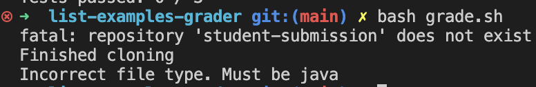

# Part 1
## Student Post 
Hello, I am anushka and I am having problems submitting my files to the grader. I am having trouble running the bash command to run the basch script grader on my file: 




The error I receive is : Incorrect file type. Must be java . When I run this command.

## TA Response 
Hello, Anushka! I see that your problem is you are not inputting the correct bash command in the terminal. try running: bash grade.sh (GIT URL REPO). 

submitting a java file. Please make sure the extension of your file is .java and the file name is ListExamples ---> (ListExamples.java)

## Student Post
![StudentFixed] (images/FixedBashCommand.png)

I see. The command needed a git url so it can access a correct java file type.


Working Directory: /Users/papaj/Desktop/list-examples-grader

ListExamples.java: 
```
import java.util.ArrayList;
import java.util.List;

interface StringChecker { boolean checkString(String s); }

class ListExamples {

  // Returns a new list that has all the elements of the input list for which
  // the StringChecker returns true, and not the elements that return false, in
  // the same order they appeared in the input list;
  static List<String> filter(List<String> list, StringChecker sc) {
    List<String> result = new ArrayList<>();
    for(String s: list) {
      if(sc.checkString(s)) {
        result.add(0, s);
      }
    }
    return result;
  }


  // Takes two sorted list of strings (so "a" appears before "b" and so on),
  // and return a new list that has all the strings in both list in sorted order.
  static List<String> merge(List<String> list1, List<String> list2) {
    List<String> result = new ArrayList<>();
    int index1 = 0, index2 = 0;
    while(index1 < list1.size() && index2 < list2.size()) {
      if(list1.get(index1).compareTo(list2.get(index2)) < 0) {
        result.add(list1.get(index1));
        index1 += 1;
      }
      else {
        result.add(list2.get(index2));
        index2 += 1;
      }
    }
    while(index1 < list1.size()) {
      result.add(list1.get(index1));
      index1 += 1;
    }
    while(index2 < list2.size()) {
      result.add(list2.get(index2));
      index1 += 1;
    }
    return result;
  }


}
```
command with error: `bash grade.sh`

command without error: `bash grade.sh https://github.com/ucsd-cse15l-f22/list-methods-lab3`
