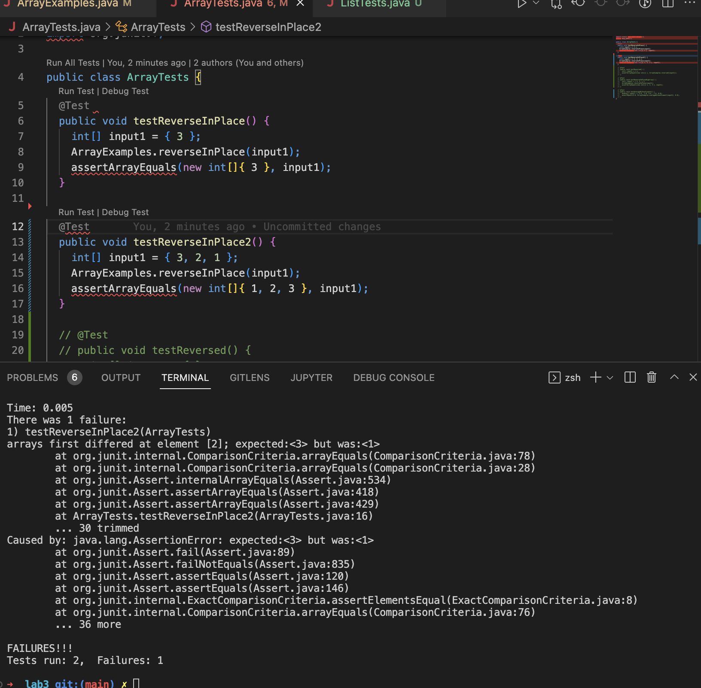

# Lab Report 3

## Part 1 - Bugs

1) 
```
@Test 
	public void testReverseInPlace() {
    int[] input1 = { 3 , 2, 1 };
    ArrayExamples.reverseInPlace(input1);
    assertArrayEquals(new int[]{ 1, 2, 3 }, input1);
	}
```
2)
```
  @Test 
	public void testReverseInPlace() {
    		int[] input1 = { 3 };
    		ArrayExamples.reverseInPlace(input1);
  		assertArrayEquals(new int[]{ 3 }, input1);
}
```

4) 
5) ## Before:
```
static void reverseInPlace(int[] arr) {
    for(int i = 0; i < arr.length/2; i += 1) {
      arr[i] = arr[arr.length - i - 1];
    }
  }
```
## After: 
```
static void reverseInPlace(int[] arr) {
    for(int i = 0; i < arr.length/2; i += 1) {
      int tempFront = arr[i];
      arr[i] = arr[arr.length - i - 1];
      arr[arr.length - i - 1] = tempFront;
    }
  }
```

Output: 
```
testReverseInPlace(ArrayTests)
arrays first differed at element [2]; expected:<3> but was:<1>`
```

## Part 2 - Researching Commands
directory: /Users/papaj/docsearch/technical/plos
command: `less -N journal.pbio.0020001.txt`
output: `
      1 
      2   
      3     
      4       
      5         
      6         Kofi Annan, the Secretary-General of the United Nations, recentl      6 y called attention to
      7         the clear inequalities in science between developing and develop      7 ed countries and to the
      8         challenges of building bridges across these gaps that should bri      8 ng the United Nations and
      9         the world scientific community closer to each other (Annan 2003)      9 . Mr. Annan stressed the
     10         importance of reducing the inequalities in science between devel     10 oped and developing
     11         countries, asserting that “This unbalanced distribution of scien     11 tific activity generates
     12         serious problems not only for the scientific community in the de     12 veloping countries, but for
     13         development itself.” Indeed, Mr. Annan's sentiments have also be     13 en echoed recently by
     14         several scientists, who present overwhelming evidence for the di     14 sparity in scientific
`
This command numbers all the lines, which is important if one would like to reference a line. 
command: `less -m journal.pbio.0020001.txt`
output:

`with 4% in the top 10). These findings suggest that publications from su
ch developing
        regions as Latin America are falling short of reaching the top journals.
 In contrast, the
        United States contributed somewhat more publications to the top 10 journ
als (84%) than the
        top 11–20 journals (79%). The difference in the proportion of publicatio
ns contributed by
        the United States to the top 10 and top 20 journals was even more pronou
nced when we
        examined it in respect to worldwide publications. In this case, the Unit
ed States
        contributed 60% of the publications to the top 10 journals and only 40% 
of the publications
        to the top 11–20 journals.
        Interestingly, the proportion of publications from Latin America, the Un
ited States, and
        Canada across all subject areas in 
        Science and 
        Nature were nearly identical to those of the top 20 ecological journals.
        In 
        Science and 
66%
`
This command shows the percentage of the text that has been viewed. 100% meaning the text has reached the end

command: `less -E journal.pbio.0020001.txt`
output: `Publishing Trends in the Americas
        Using the SCI databases produced by the Institute for Scientific Information (ISI), as
        well as data compiled by the Red Iberoamericana de Indicadores de Ciencia y Tecnología
        (RICYT), we examined the differences in the number and proportion of scientific
        publications between the developed world and the developing world from 1990 until 2000,
        focusing on the Americas as a case study. Not surprisingly, there was a huge disparity in
        the number of publications from 1990 until 2000, with the United States contributing the
        lion's share (84.2%), followed by Canada (10.35%). Latin America as a whole contributed
        only 5.45% to the total number of scientific publications in these ten years (RICYT
        2002).
`
This command exits the file once user has reached the end of the file. This is useful to be quick and efficient if one does not feel like manually exiting the file once finished. 

command: `less -X journal.pbio.0020001.txt`
output: `

`

  
    plos git:(main) ✗ less -X journal.pbio.0020001.txt
      
        
        Kofi Annan, the Secretary-General of the United Nations, recently called attention to
        the clear inequalities in science between developing and developed countries and to the
        challenges of building bridges across these gaps that should bring the United Nations and
        the world scientific community closer to each other (Annan 2003). Mr. Annan stressed the
        importance of reducing the inequalities in science between developed and developing
        countries, asserting that “This unbalanced distribution of scientific activity generates
        serious problems not only for the scientific community in the developing countries, but for
        development itself.” Indeed, Mr. Annan's sentiments have also been echoed recently by
        several scientists, who present overwhelming evidence for the disparity in scientific 	
	➜  plos git:(main) ✗ 
`
This command saves the files contents even after exitting. This is useful if one does not want to rerun the less command to look through the files content's again when they are in the terminal. 


PWD: /Users/papaj/docsearch/technical/biomed

command: `less -N 1468-6708-3-1.txt`
output: `
      2   
      3     
      4       
      5         Introduction
      6         Older adults are frequently counseled to lose weight,
      7         even though there is little evidence that overweight is
      8         associated with increased mortality in those over age 65.
      9         Six large controlled population-based studies of
     10         non-smoking older adults have investigated the association`

This command numbers all the lines, which is important if one would like to reference a line. 

command: `less -m 1468-6708-3-1.txt`
output: `
          Years of life and years of healthy life
          YOL is the number of years that a person lived in the
          7 years after baseline. YHL is the number of years in
          which the person was 'healthy', and is similar in concept
          to quality-adjusted life-years, healthy year equivalents,
18%`

This command shows the percentage of the text that has been viewed. 100% meaning the text has reached the end

command: `less -E 1468-6708-3-1.txt`
output: `
Covariates
          The goal is to examine the association of YOL and YHL
          with BMI. To adjust for possible confounding we chose
          baseline covariates that were prevalent in the elderly,
          related to mortality and morbidity in previous studies,
          and likely to be related to BMI. Self-reported covariates
          include age, gender, smoking (never or former), history
          of arthritis, cancer, diabetes, fair or poor self-rated
          health status, limitations in activities of daily living
          or in instrumental activities of daily living, and 10
          pounds or more unintended weight loss in the year before
          baseline. Clinical covariates include hypertension,
          cardiovascular disease (prevalent heart disease,
          peripheral vascular disease, or cerebrovascular disease),
          maximum thickness of the internal carotid artery,
          depression (CESD score), serum albumin, serum`

This command exits the file once user has reached the end of the file. This is useful to be quick and efficient if one does not feel like manually exiting the file once finished. 

command: `less -X 1468-6708-3-1.txt`
output: `	

	➜  biomed git:(main) ✗ less -X 1468-6708-3-1.txt

  
    
      
        Introduction
        Older adults are frequently counseled to lose weight,
        even though there is little evidence that overweight is
        associated with increased mortality in those over age 65.
        Six large controlled population-based studies of
        non-smoking older adults have investigated the association
        between body mass index (BMI) and mortality, controlling
        for relevant covariates [ 1 2 3 4 5 6 ] . All studies found
        excess risk for persons with very low BMI, but that persons
        with moderately high BMI had little or no extra risk except
        in certain small subsets. A review of 13 studies of older
        adults drew similar conclusions [ 7 ] .
        Many healthy older adults report gradual weight gain
        throughout adult life. It may be that a small amount of
        gradual weight gain is normative and associated with the
        most robust health as we age. It has been suggested that
        weight standards be adjusted upwards for age [ 8 ] . Such
        recommendations remain controversial, however, because the
        number of studies of older persons is fairly small, and
	➜  biomed git:(main) ✗ `
This command saves the files contents even after exitting. This is useful if one does not want to rerun the less command to look through the files content's again when they are in the terminal. 
